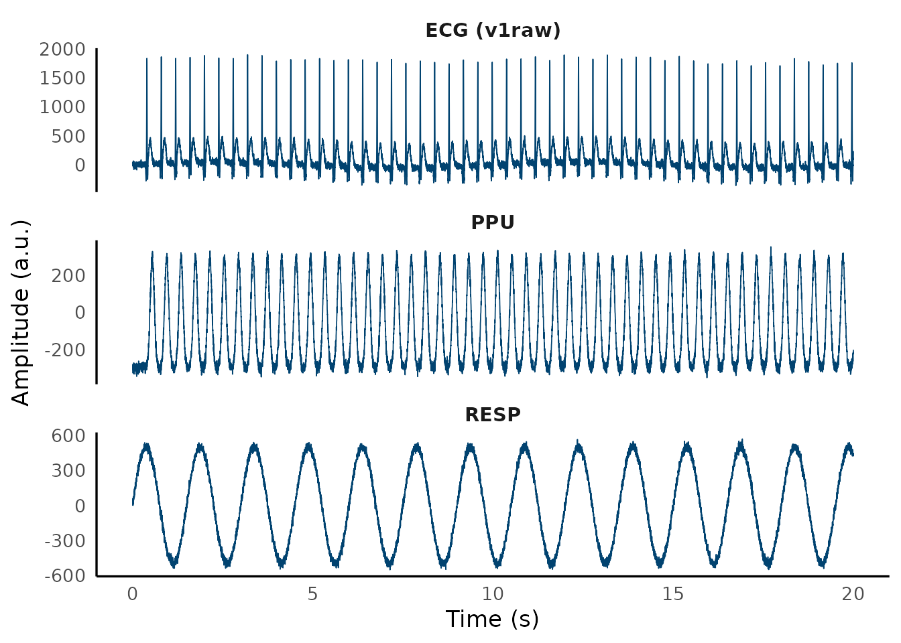
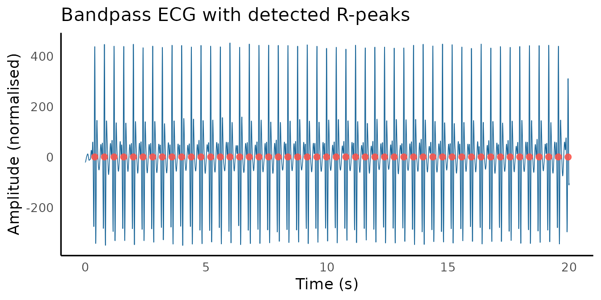
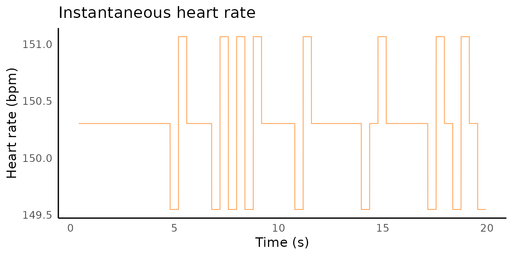

# MRI physiological signal processing

Philips MRI scanners record cardiac, respiratory, and motion signals
alongside the BOLD acquisition via the Physiological Monitoring Unit
(PMU). mrpheus can read these `.log` files, detect QRS complexes with
the Pan-Tompkins algorithm, and compute instantaneous heart rate —
producing cardiac regressors ready for RETROICOR or HRV analysis.

``` r

library(mrpheus)
library(ggplot2)
library(gsignal)
```

------------------------------------------------------------------------

## Reading a Philips PMU log

[`read_philips_physlog()`](https://mrpheus.circadia-lab.uk/reference/read_philips_physlog.md)
parses any Philips PMU `.log` file and returns a `mrpheus_physlog`
object containing the signal matrix, event markers, and recording
metadata.

``` r

path <- system.file("extdata", "example_physlog.log", package = "mrpheus")
rec  <- read_philips_physlog(path)
rec
#> 
#> ── mrpheus Philips PMU recording ───────────────────────────────────────────────
#> ℹ Path: /home/runner/work/_temp/Library/mrpheus/extdata/example_physlog.log
#> ℹ System: wBTU (496 Hz)
#> ℹ Channels: v1raw, v2raw, v1, v2, ppu, resp, gx, gy, gz, mark
#> ℹ Samples: 9920 (0.3 min)
#> ℹ Markers: 52 events
```

The `system` argument sets the hardware preset:

``` r

# Wireless VCG (Achieva/Ingenia dStream) — default
rec <- read_philips_physlog(path, system = "wBTU")

# Older wired ECG system (500 Hz)
rec <- read_philips_physlog(path, system = "wired")

# Site-specific sampling rate
rec <- read_philips_physlog(path, system = "custom", sfreq = 400)
```

The resolved sampling frequency is always at `rec$HDR$sfreq` so nothing
downstream needs to hardcode it.

### Signal channels

``` r

ecg  <- as.double(rec$C[, "v1raw"])
ppu  <- as.double(rec$C[, "ppu"])
resp <- as.double(rec$C[, "resp"])
```

The wBTU layout provides ten channels:

| Channel          | Contents                          |
|------------------|-----------------------------------|
| `v1raw`, `v2raw` | Raw VCG electrode voltages        |
| `v1`, `v2`       | Processed VCG signals             |
| `ppu`            | Peripheral pulse unit (PPG, foot) |
| `resp`           | Respiratory belt                  |
| `gx`, `gy`, `gz` | 3-axis accelerometer              |
| `mark`           | Bit-encoded event marker          |



### Event markers

``` r

rec$I$ScannerStart
#> [1] 496
rec$I$ScannerStop
#> [1] 9466
head(rec$I$VcgOnset)
#> [1]  198  396  594  792  990 1188
```

------------------------------------------------------------------------

## QRS detection

[`detect_qrs()`](https://mrpheus.circadia-lab.uk/reference/detect_qrs.md)
implements the Pan-Tompkins (1985) algorithm and returns a `mrpheus_qrs`
object.

``` r

qrs <- detect_qrs(ecg, fs = rec$HDR$sfreq)
qrs
#> 
#> ── mrpheus QRS detection ───────────────────────────────────────────────────────
#> ℹ R-peaks detected: 50
#> ℹ Mean HR: 150 bpm
#> ℹ Filter delay: 37 samples (0.075 s)
#> ℹ Sampling rate: 496 Hz
```

R-peak indices are in `qrs$qrs_i`. Account for `qrs$delay` if you need
indices aligned to the raw (pre-filter) ECG.



``` r

rr_ms <- diff(qrs$qrs_i) / rec$HDR$sfreq * 1000
cat("Mean RR :", round(mean(rr_ms)), "ms\n")
#> Mean RR : 399 ms
cat("SDNN    :", round(sd(rr_ms)), "ms\n")
#> SDNN    : 1 ms
```

### PPU as an alternative

In neonates, PPU often gives a cleaner signal than the ECG electrodes.
[`detect_qrs()`](https://mrpheus.circadia-lab.uk/reference/detect_qrs.md)
accepts any pulsatile channel:

``` r

qrs_ppu <- detect_qrs(as.double(rec$C[, "ppu"]), fs = rec$HDR$sfreq)
```

------------------------------------------------------------------------

## Heart rate signal

[`compute_hr_signal()`](https://mrpheus.circadia-lab.uk/reference/compute_hr_signal.md)
converts R-peak indices into a sample-by-sample instantaneous HR trace
(bpm). It reads `fs` from the `mrpheus_qrs` object directly:

``` r

hr <- compute_hr_signal(qrs)
```



------------------------------------------------------------------------

## Epoch extraction

To extract the physiology aligned to the fMRI scan, use the scanner-stop
marker. This is more reliable than the start marker because the exact
recording onset varies but the stop is always clean:

``` r

sfreq    <- rec$HDR$sfreq
enddelay <- 42L
tr       <- 0.392
vols     <- 47L

stopidx  <- tail(rec$I$ScannerStop, 1L) - enddelay
startidx <- max(1L, stopidx - round(vols * tr * sfreq))
epoch    <- rec$C[startidx:stopidx, ]
cat("Epoch:", nrow(epoch), "samples /", round(nrow(epoch) / sfreq, 1), "s\n")
#> Epoch: 9139 samples / 18.4 s
```

### RR intervals per TR

``` r

qrs_epoch <- detect_qrs(as.double(epoch[, "v1raw"]), fs = sfreq)

rr_t <- qrs_epoch$qrs_i[-1] / sfreq
rr_s <- diff(qrs_epoch$qrs_i) / sfreq

tr_times <- seq(0, vols * tr, by = tr)
rr_tr    <- approx(rr_t, rr_s, xout = tr_times, method = "constant")$y

cat("RR per TR (first 5):", round(rr_tr[1:5] * 1000), "ms\n")
#> RR per TR (first 5): NA NA 399 399 399 ms
```

`rr_tr` is a length-`vols` vector ready for RETROICOR phase computation
or inclusion as a nuisance regressor in a GLM.

------------------------------------------------------------------------

## Full pipeline

``` r

library(mrpheus)

rec      <- read_philips_physlog("sub-01_ses-01_physlog.log")
sfreq    <- rec$HDR$sfreq
stopidx  <- tail(rec$I$ScannerStop, 1L) - 42L
startidx <- stopidx - round(2300L * 0.392 * sfreq)
epoch    <- rec$C[startidx:stopidx, ]
qrs      <- detect_qrs(as.double(epoch[, "v1raw"]), fs = sfreq)
hr       <- compute_hr_signal(qrs)
rr_tr    <- approx(
  x      = qrs$qrs_i[-1] / sfreq,
  y      = diff(qrs$qrs_i) / sfreq,
  xout   = seq(0, 2300 * 0.392, by = 0.392),
  method = "constant"
)$y
```

------------------------------------------------------------------------

## References

Pan J, Tompkins WJ. A real-time QRS detection algorithm. *IEEE Trans
Biomed Eng.* 1985;32(3):230–236.
<https://doi.org/10.1109/TBME.1985.325532>

Groot PFC. *ReadPhilipsScanPhysLog* (MATLAB). AMC Amsterdam. 2010.

Glover GH, Li TQ, Ress D. Image-based method for retrospective
correction of physiological motion effects in fMRI: RETROICOR. *Magn
Reson Med.* 2000;44(1):162–167.
