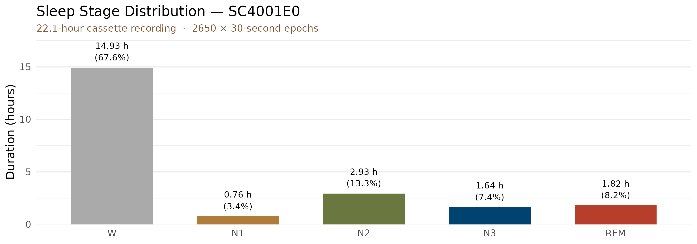
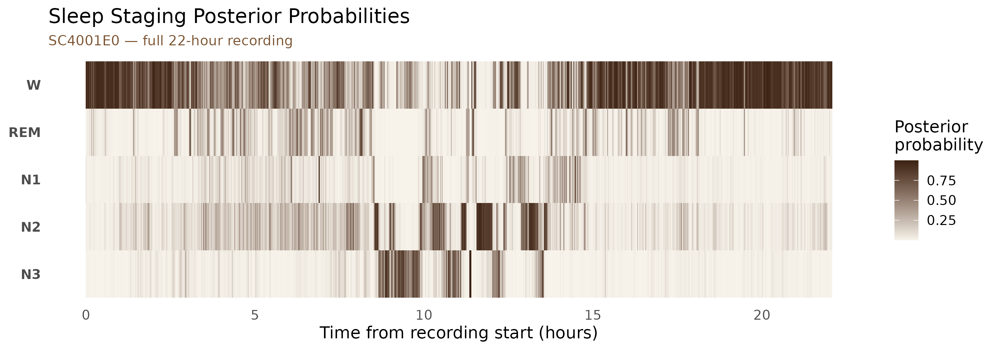
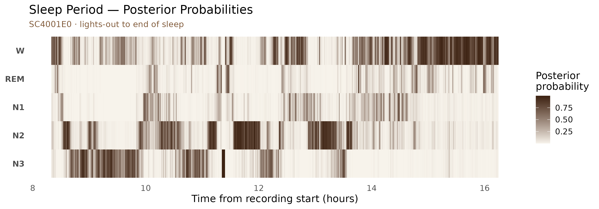
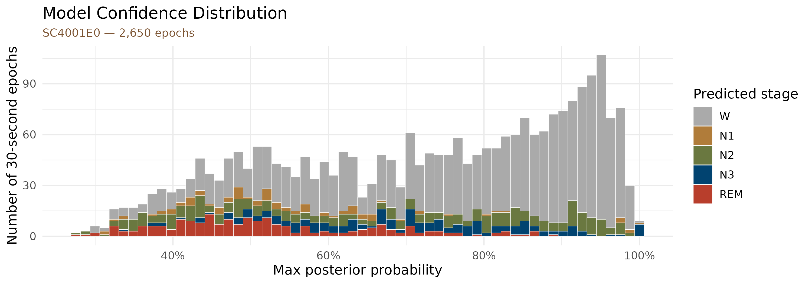

# Sleep Staging: Live Walkthrough (SC4001E0)

``` r

library(mrpheus)
library(dplyr)
library(tidyr)
library(ggplot2)
```

This article runs the complete mrpheus sleep staging pipeline on
**SC4001E0-PSG.edf** from the Sleep-EDF Cassette study (Kemp et al.,
2000) — a 22-hour ambulatory PSG of a healthy young adult. For download
instructions see
[`vignette("sleep-staging")`](https://mrpheus.circadia-lab.uk/articles/sleep-staging.md).

The Sleep-EDF Cassette recordings start mid-afternoon and capture a full
sleep-wake cycle plus the following morning. Around 75% of the recording
is daytime Wake; the sleep period is approximately 7–8 hours.

------------------------------------------------------------------------

## Pipeline

The code below shows the full pipeline. Results are loaded from a
pre-computed dataset bundled with the package (the EDF is too large to
include, but the staging output is identical).

``` r

rec <- read_edf("~/mne_data/physionet-sleep-data/SC4001E0-PSG.edf")
psg <- prepare_psg(rec)

staging <- stage_epochs(
  psg,
  eeg_channel = "EEG Fpz-Cz",
  eog_channel = "EOG horizontal",
  emg_channel = "EMG submental"
)
```

``` r

staging
#> # A tibble: 2,650 × 7
#>    epoch stage prob_N1 prob_N2 prob_N3 prob_REM prob_W
#>    <int> <chr>   <dbl>   <dbl>   <dbl>    <dbl>  <dbl>
#>  1     1 W     0.111   0.00803 0.00192  0.0335   0.846
#>  2     2 W     0.00878 0.0121  0.00364  0.00233  0.973
#>  3     3 W     0.00261 0.00409 0.00178  0.00269  0.989
#>  4     4 W     0.0621  0.0575  0.00901  0.0220   0.849
#>  5     5 W     0.102   0.143   0.0260   0.0845   0.644
#>  6     6 W     0.00921 0.0110  0.0137   0.00935  0.957
#>  7     7 W     0.00234 0.00647 0.00581  0.00378  0.982
#>  8     8 W     0.00475 0.0196  0.00973  0.100    0.866
#>  9     9 W     0.00750 0.0231  0.00910  0.0151   0.945
#> 10    10 W     0.00482 0.0141  0.00246  0.0264   0.952
#> # ℹ 2,640 more rows
```

------------------------------------------------------------------------

## Stage distribution

``` r

stage_summary <- staging |>
  count(stage) |>
  mutate(
    stage      = factor(stage, levels = c("W", "N1", "N2", "N3", "REM")),
    duration_h = round(n * 30 / 3600, 2),
    pct        = round(n / nrow(staging) * 100, 1)
  ) |>
  arrange(stage)

stage_summary
#> # A tibble: 5 × 4
#>   stage     n duration_h   pct
#>   <fct> <int>      <dbl> <dbl>
#> 1 W      1792      14.9   67.6
#> 2 N1       91       0.76   3.4
#> 3 N2      352       2.93  13.3
#> 4 N3      197       1.64   7.4
#> 5 REM     218       1.82   8.2
```

``` r

stage_summary |>
  ggplot(aes(x = stage, y = duration_h, fill = stage)) +
  geom_col(width = 0.65) +
  geom_text(aes(label = paste0(duration_h, " h\n(", pct, "%)")),
            vjust = -0.4, size = 3.2, lineheight = 1.1) +
  scale_fill_manual(values = stage_pal) +
  scale_y_continuous(expand = expansion(mult = c(0, 0.18))) +
  labs(
    x     = NULL,
    y     = "Duration (hours)",
    title = "Sleep Stage Distribution — SC4001E0",
    subtitle = sprintf(
      "%.1f-hour cassette recording  ·  %d × 30-second epochs",
      nrow(staging) * 30 / 3600, nrow(staging)
    )
  ) +
  theme_minimal(base_size = 12) +
  theme(
    legend.position    = "none",
    panel.grid.major.x = element_blank(),
    plot.subtitle      = element_text(colour = "#7C5432", size = 10)
  )
```



Wake accounts for the majority of the recording because the cassette
started at ~16:13 local time and ran continuously through the night and
into the following afternoon.

------------------------------------------------------------------------

## Posterior probability heatmap

Each epoch carries five posterior probabilities (one per AASM stage)
that sum to 1. Visualising all five simultaneously over the full
recording reveals both the overall structure of the night and the
model’s confidence at each point in time.

``` r

staging |>
  select(epoch, starts_with("prob_")) |>
  pivot_longer(starts_with("prob_"), names_to = "stage", values_to = "prob") |>
  mutate(
    stage  = factor(sub("prob_", "", stage), levels = c("N3", "N2", "N1", "REM", "W")),
    time_h = (epoch - 1L) * 30 / 3600
  ) |>
  ggplot(aes(x = time_h, y = stage, fill = prob)) +
  geom_tile() +
  scale_fill_gradient(
    low  = "#F7F3EB",
    high = "#3C2212",
    name = "Posterior\nprobability",
    guide = guide_colourbar(barheight = 4)
  ) +
  labs(
    x        = "Time from recording start (hours)",
    y        = NULL,
    title    = "Sleep Staging Posterior Probabilities",
    subtitle = "SC4001E0 — full 22-hour recording"
  ) +
  theme_minimal(base_size = 12) +
  theme(
    plot.subtitle = element_text(colour = "#7C5432", size = 10),
    panel.grid    = element_blank(),
    axis.text.y   = element_text(face = "bold")
  )
```



The dark band in the **W** row spanning the first ~8 hours and last ~5
hours reflects the daytime Wake periods before and after sleep. The
sleep period (roughly hours 8.5–17) is visible as sustained activity in
the **N2**, **N3**, and **REM** rows.

------------------------------------------------------------------------

## Sleep period in detail

Zooming into the sleep window (starting from just before lights-out at
~30,600 s ≈ hour 8.5) makes the ultradian architecture clearer.

``` r

staging |>
  filter(epoch >= 1001L, epoch <= 1950L) |>
  select(epoch, starts_with("prob_")) |>
  pivot_longer(starts_with("prob_"), names_to = "stage", values_to = "prob") |>
  mutate(
    stage  = factor(sub("prob_", "", stage), levels = c("N3", "N2", "N1", "REM", "W")),
    time_h = (epoch - 1L) * 30 / 3600
  ) |>
  ggplot(aes(x = time_h, y = stage, fill = prob)) +
  geom_tile() +
  scale_fill_gradient(
    low  = "#F7F3EB",
    high = "#3C2212",
    name = "Posterior\nprobability",
    guide = guide_colourbar(barheight = 4)
  ) +
  labs(
    x        = "Time from recording start (hours)",
    y        = NULL,
    title    = "Sleep Period — Posterior Probabilities",
    subtitle = "SC4001E0 · lights-out to end of sleep"
  ) +
  theme_minimal(base_size = 12) +
  theme(
    plot.subtitle = element_text(colour = "#7C5432", size = 10),
    panel.grid    = element_blank(),
    axis.text.y   = element_text(face = "bold")
  )
```



------------------------------------------------------------------------

## Model confidence

High posterior probabilities indicate epochs the model is unambiguous
about. Lower values reflect genuine signal ambiguity at stage
transitions or in epochs with mixed features.

``` r

staging |>
  mutate(
    stage      = factor(stage, levels = c("W", "N1", "N2", "N3", "REM")),
    confidence = pmax(prob_N1, prob_N2, prob_N3, prob_REM, prob_W)
  ) |>
  ggplot(aes(x = confidence, fill = stage)) +
  geom_histogram(bins = 60, colour = "white", linewidth = 0.15) +
  scale_fill_manual(values = stage_pal) +
  scale_x_continuous(labels = scales::percent_format()) +
  labs(
    x        = "Max posterior probability",
    y        = "Number of 30-second epochs",
    fill     = "Predicted stage",
    title    = "Model Confidence Distribution",
    subtitle = "SC4001E0 — 2,650 epochs"
  ) +
  theme_minimal(base_size = 12) +
  theme(plot.subtitle = element_text(colour = "#7C5432", size = 10))
```



Most epochs concentrate near 1.0, reflecting high model confidence. The
lower-confidence tail consists primarily of **N1** epochs and brief
transitions between stages.

------------------------------------------------------------------------

## Passing to hypnor

The `staging` tibble can be passed directly to **hypnor** for hypnogram
visualisation and sleep architecture metrics:

``` r

hypnogram <- export_hypnogram(
  staging,
  epoch_s        = 30,
  start_time     = rec$header$startTime,
  participant_id = "SC4001"
)

# hypnor::plot_hypnogram(hypnogram)
# hypnor::compute_architecture(hypnogram)
```

------------------------------------------------------------------------

## References

Kemp, B., Värri, A., Rosa, A. C., Nielsen, K. D., & Gade, J. (2000). A
simple format for exchange of digitized polygraphic recordings.
*Electroencephalography and Clinical Neurophysiology*, 69(5), 391–397.
<https://doi.org/10.1016/0013-4694(87)90048-7>

Vallat, R., & Walker, M. P. (2021). An open-source, high-performance
tool for automated sleep staging. *eLife*, 10, e70092.
<https://doi.org/10.7554/eLife.70092>
